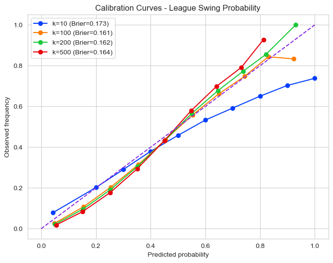
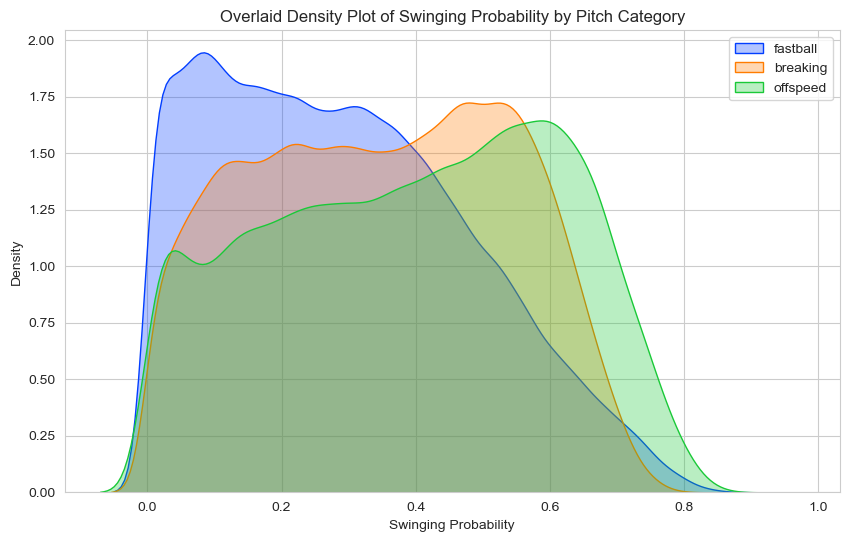
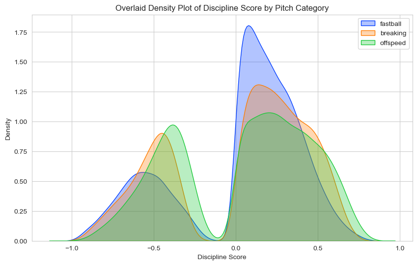
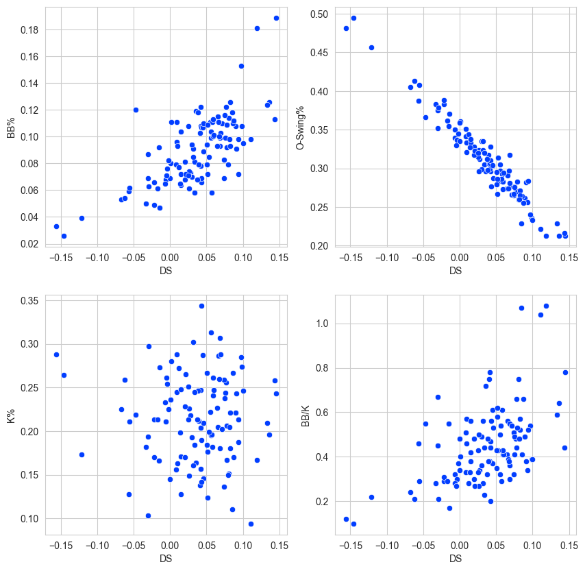
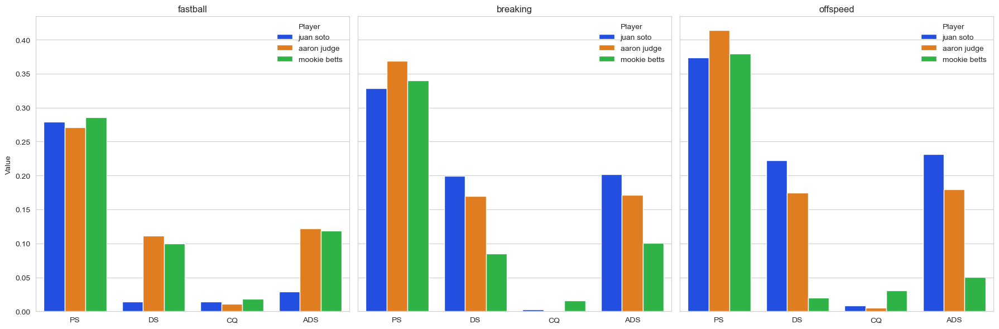

# Discipline Score

## Introduction

Plate discipline is an important part of hitting. A hitter must decide within a fraction of a second whether to swing, yet conventional statistics often evaluate that decision without considering how difficult the pitch was to recognize or resist.

Discipline Score (DS) is an experimental pitch-level metric designed to measure the quality of a hitter's swing decision. Instead of treating every chase as equally poor and every take as equally good, DS estimates how likely a comparable pitch is to induce a swing. A hitter receives more credit for taking a tempting pitch and a larger penalty for swinging at a pitch that comparable hitters usually take.

The project also introduces Adjusted Discipline Score (ADS), which combines the quality of the decision with a simple measure of contact quality. Together, the two metrics separate two related questions: whether the hitter made a disciplined choice and what happened when contact was made.

## Background

Common plate-discipline statistics include chase rate (`O-Swing%`), walk rate, strikeout rate, and walk-to-strikeout ratio. These measures are valuable, but they summarize outcomes across many pitches. They do not fully account for the fact that pitches outside the strike zone vary greatly in location, velocity, movement, spin, count, and handedness matchup.

For example, a fastball barely above the zone and a breaking ball far from the plate may both be recorded as out-of-zone pitches. Taking the first pitch may require much more discipline, while swinging at the second may represent a clearer mistake. A context-aware metric should distinguish between these situations.

Discipline Score addresses this limitation by first estimating the league-wide probability of a swing on a similar pitch. The observed swing or take is then evaluated relative to that probability rather than only by the pitch's final zone label.

## Data

The analysis uses MLB Statcast pitch-level data obtained through `pybaseball`.

- 2021–2023 regular-season pitches are used for model development.
- 2024 regular-season pitches are used for evaluation and hitter-level scoring.
- The analysis focuses on pitches outside the approximate strike zone, where swing decisions are most directly related to chase discipline.
- Candidate predictors include horizontal and normalized vertical location, release velocity, spin rate, horizontal and vertical movement, ball-strike count, pitcher-batter handedness, pitch type, and release extension.
- Launch speed and launch angle are used only for the experimental contact-quality adjustment.

Pitch descriptions are converted into a binary decision: `1` represents a swing and `0` represents a take. Pitch types are also grouped into fastball, breaking-ball, and offspeed families for the nearest-neighbor analysis and result comparisons.

Raw and cleaned CSV files are deliberately excluded from this repository because they are large and can be regenerated from the date ranges recorded in the notebooks. Statcast data may receive upstream corrections, so a formal replication should record its retrieval date and preserve a local snapshot.

## Method

### Estimating swing probability

The project explores two approaches to estimating the probability that an average hitter swings at a particular pitch:

1. A multilayer perceptron uses location, pitch characteristics, count, handedness, and pitch type to estimate swing probability.
2. A K-nearest-neighbors approach finds comparable pitches within each broad pitch family and uses the neighboring swing decisions as the probability estimate.

Probability quality is evaluated with calibration curves and the Brier score. The KNN workflow also compares several values of `k` to show how neighborhood size changes calibration and smoothness.

### Discipline Score

Let `p` be the estimated probability of a swing and `r` be the observed decision, where `r = 1` is a swing and `r = 0` is a take:

```text
DS = (-1)^r [r(1-p) + (1-r)p]
```

The formula can be read more simply as:

- take: `DS = p`
- swing: `DS = -(1-p)`

A take always receives a nonnegative value, with a larger reward when the pitch was especially tempting. A swing receives a nonpositive value, with a larger penalty when the pitch was unlikely to induce a swing. Player-level DS is calculated by averaging pitch-level scores.

### Contact Quality and ADS

The experimental contact-quality value (`CQ`) combines exit velocity and launch angle for balls put into play. Takes, misses, and fouls receive zero contact quality. The current implementation assigns the highest value to hard contact near a 20-degree launch angle.

```text
ADS = DS + CQ
```

ADS gives some credit to productive contact while keeping the original decision score available for interpretation. This adjustment is intentionally simple and should be treated as exploratory.

## Results

### Probability calibration

The KNN sensitivity check compares several neighborhood sizes. Very small neighborhoods produce noisier probability estimates, while larger values track observed swing frequency more consistently through most of the probability range. The Brier scores in the legend summarize overall probability error.



### Swing probability by pitch category

Estimated swing probability differs across pitch families. In this sample, offspeed and breaking pitches tend to occupy higher probability ranges than fastballs, although the distributions overlap substantially. This variation supports evaluating pitches from their context instead of treating every out-of-zone pitch alike.



### Discipline Score distribution

Pitch-level DS has two visible regions because takes receive positive values and swings receive negative values. The shape and spread vary by pitch family, reflecting differences in how tempting comparable pitches are estimated to be.



### Comparison with established metrics

At the hitter level, DS shows interpretable relationships with established plate-discipline outcomes. The clearest visual relationship is with chase rate (`O-Swing%`): hitters with higher DS generally chase less often. Relationships with walk rate, strikeout rate, and walk-to-strikeout ratio are noisier, suggesting that DS captures a related but not identical part of hitting performance.



### Player comparison

The selected-player comparison illustrates how expected swing probability, decision quality, contact quality, and adjusted score can tell different stories across pitch groups. It is an exploratory example rather than a definitive player ranking.



### Limitations

Discipline Score is a research metric rather than a finalized public leaderboard. Results depend on the swing-probability model, pitch selection, sample period, and treatment of missing contact data. The neural-network and KNN estimates should be validated out of sample before their rankings are compared directly. ADS is especially experimental because its contact-quality formula is not adjusted for park, count, defense, or game context.

## Repository Information

### Structure

```text
discipline_score/
├── README.md
├── requirements.txt
├── discipline_score.py
├── model_training.ipynb
├── score_implementation.ipynb
├── knn_analysis.ipynb
└── images/
│   ├── calibration_curve.png
│   ├── discipline_score_distribution.png
│   ├── discipline_score_relationships.png
│   ├── player_comparison.png
│   └── swing_probability_by_pitch.png
```

### File descriptions

- `discipline_score.py` contains reusable functions for pitch categorization, swing labeling, strike-zone filtering, vertical-location normalization, contact quality, DS, and ADS.
- `model_training.ipynb` downloads and cleans 2021–2023 Statcast data, trains the PyTorch swing-probability model, and saves the required artifacts.
- `score_implementation.ipynb` downloads 2024 data, applies the trained model, calculates DS and ADS, aggregates scores by hitter, and compares them with conventional statistics.
- `knn_analysis.ipynb` estimates swing probability with nearest neighbors, evaluates calibration, creates summaries, and produces the exploratory figures.
- `images/` contains the selected figures displayed in this report.

The notebooks preserve the original research workflow. Some exploratory plotting cells reference personal helper modules named `plot` and `search`. These modules are not required by `discipline_score.py`, but the affected notebook cells must be replaced with equivalent pandas, Matplotlib, or Seaborn operations before they can run independently on another computer.

### Installation

Python 3.10 or newer is recommended.

```bash
python -m venv .venv
source .venv/bin/activate
python -m pip install -r requirements.txt
```

Start Jupyter from the repository root so generated files are resolved consistently:

```bash
jupyter lab
```

Run `model_training.ipynb` first to generate the cleaned training data, pitch-type mapping, and trained model. Next, run `score_implementation.ipynb` to generate the evaluation data and hitter scores. Use `knn_analysis.ipynb` for the alternative nearest-neighbor analysis and visualizations.

### Using the core functions

```python
import pandas as pd

from discipline_score import add_scores

pitches = pd.DataFrame(
    {
        "swing": [0, 1],
        "swing_probability": [0.70, 0.20],
        "description": ["ball", "hit_into_play"],
        "launch_speed": [None, 98.0],
        "launch_angle": [None, 20.0],
    }
)

scored = add_scores(pitches)
print(scored[["discipline_score", "contact_quality", "adjusted_discipline_score"]])
```
